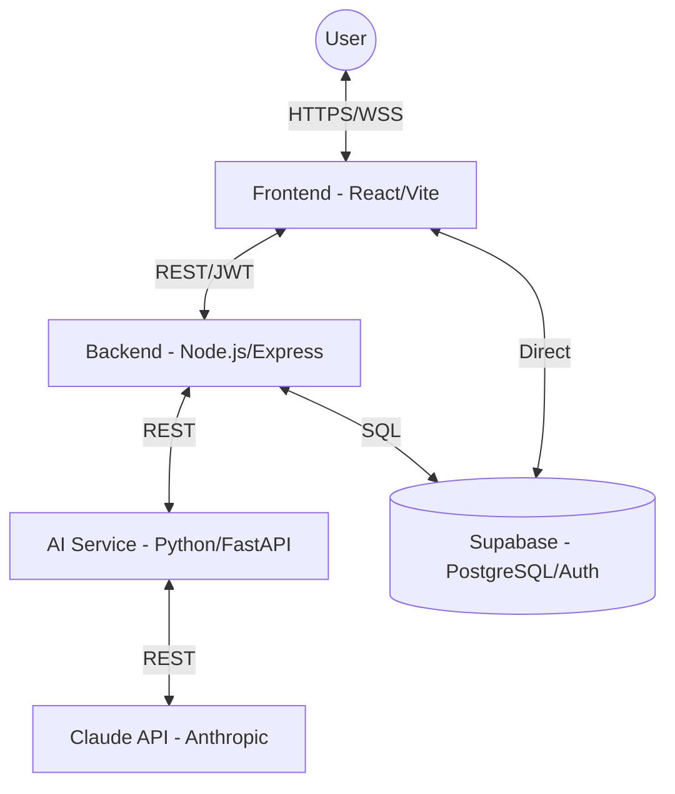

# Relavo — System Architecture

Relavo is an AI-powered client relationship health platform designed for small businesses. It provides an early warning system to prevent client churn by monitoring various signals and generating AI-driven insights.

## System Overview

Relavo uses a microservices-inspired architecture to separate concerns between business logic, AI processing, and the user interface.

## Core Modules

### 1. Frontend (`/frontend`)
- **Technology**: React 18, Vite, Tailwind CSS, Zustand, Recharts.
- **Purpose**: Provides the user interface for managing clients, viewing health scores, logging touchpoints, and receiving alerts.
- **Key Features**: Client Dashboard, Health Score Visualization, Smart Alerts, Touchpoint Logger, AI Email Drafter.

### 2. Backend (`/backend`)
- **Technology**: Node.js, Express.
- **Purpose**: The main business logic layer. It manages client data, handles authentication (via Supabase), and orchestrates calls to the AI Service.
- **Key Features**: REST API for client management, alert generation, and data aggregation.

### 3. AI Service (`/ai-service`)
- **Technology**: Python 3.10+, FastAPI, Claude SDK.
- **Purpose**: Handles all AI-heavy tasks including health score calculation, natural language summary generation, and email drafting.
- **Key Features**: Pure rule-based scoring combined with Claude-driven insights.

### 4. Database & Auth (Supabase)
- **Technology**: PostgreSQL (managed), GoTrue (Auth).
- **Purpose**: Relational storage for clients, touchpoints, invoices, and alerts. Handles user identity and session management.

## Service Connectivity

| From | To | Protocol | Auth Type |
|------|----|----------|-----------|
| Frontend | Backend | REST | JWT (Supabase) |
| Frontend | Supabase | Direct | Anon Key / User JWT |
| Backend | AI Service | REST | API Key / Internal VPC |
| Backend | Supabase | SQL | Service Role Key |
| AI Service | Claude API | REST | Anthropic API Key |

## Data Flow: Health Score Calculation

1. **Trigger**: A cron job (or manual refresh) triggers the calculation in the Backend.
2. **Data Aggregation**: Backend fetches recent touchpoints, invoices, and activity logs for a client from Supabase.
3. **AI Processing**: Aggregated data is sent to the AI Service (`/score` and `/summarize`).
4. **Insight Generation**: AI Service applies weighted formulas for the score and sends a prompt to Claude for the plain-English insight.
5. **Storage**: The results (score + insight) are saved back to the `health_scores` table in Supabase.
6. **Delivery**: The Frontend receives updates via real-time subscriptions or a page refresh.

## Environment Architecture

The project requires the following unified environment configuration across services:

| Variable | Usage |
|----------|-------|
| `SUPABASE_URL` | Connecting to database and auth |
| `SUPABASE_ANON_KEY` | Frontend auth operations |
| `ANTHROPIC_API_KEY` | AI Service Claude integration |
| `BACKEND_URL` | Frontend API calls |
| `AI_SERVICE_URL` | Backend orchestration calls |
